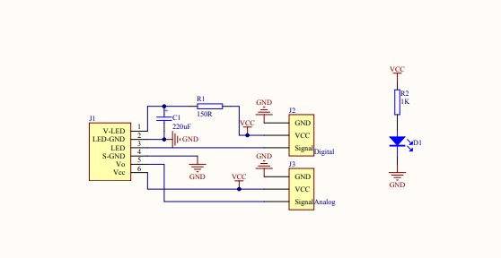

# Used parts

**Raspberry Pi Pico HW** 
(W for reporting over wifi, and H for easier connections)

**Fan**
https://botland.com.pl/gravity-aktuatory/3559-dfrobot-gravity-modul-wiatraka-z-silnikiem-dc-3-6v-5903351243643.html
                                   
Fan is to direct the airflow to the dust sensor. Otherwise it might be skipped.

**Relay** 
cheap chinese relay
requires 5V on IN while RPI provides 3v, needs transistor to increase current
https://botland.com.pl/przekazniki-przekazniki-arduino/8463-modul-przekaznika-1-kanal-styki-10a250vac-cewka-5v-5904422300517.html 

**Dust sensor**
Sharp GP2Y1010AU0F Compact optical Dust Sensor
https://botland.com.pl/czujniki-czystosci-powietrza/8587-czujnik-pylustezenia-czastek-monitor-czystosci-powietrza-pm25-gp2y1010au0f-5904422366087.html
D toggles the diode, output is provided on A
pin 1 - VCC for IR
pin 2 - GND for IR
pin 3 - for LED
pin 4 - GND for module
pin 5  - analog output
pin 6 - VCC input (accepts 0.3V..7V)

It's connected thru the dust adapter adapter                           

**Dust sensor adapter**
DFRobot Gravity GP2Y1010AU0F
https://botland.com.pl/gravity-konwertery-i-przetworniki/11282-dfrobot-gravity-adapter-do-czujnika-pylu-gp2y1010au0f-5904422317454.html
it makes it easier to connect the dust sensor
                  
Dust sensor adapter diagram

*air duct fan*
anything working on 230V, by usually connected with a string switch 
or short wired with the light.
                                           
**transistor NPN**
why it works as a switch?
https://www.electronics-tutorials.ws/transistor/tran_4.html

---

# Connections

# base setup

USB -> raspberry pi pico

pico VSys -> 5V line
pico GND pin -> GND line

## Dust sensor setup:

GP27_A1 -> Dust Sensor Adapter A pin (lowest)
GP3 -> Dust Sensor Adapter D pin (3rd from top)

Dust Sensor Adapter Vcc (2x) -> VCC
Dust Sensor Adapter GND (2x) -> GND
                                              

Fan 5+v -> 5+v line
Fan GND -> GND line
GP0 -> Fan signal pin (PWM modulation)

(transistor BCS 546 - NPN )

5+V line -> 100 ohm Resistor -> Transistor collector (1 of 2 input lines)
GP10 -> 10K ohm resistor -> Transistor base
Transistor emitter -> GND 

Relay GND -> GND line
Relay VCC -> 5+V line
Relay IN -> Transistor Collector (2 of 2) 
                     
Relay Common pin (middle) -> 230V 
Relay Enabled pin -> 230V             
Relay common+Enabled pin => in series with the air duct fan() as part of its 230V circuit)
relay opens/closes the circuit with regular 230V

---
VBUS:
    5VCC line:
        Fan 5v
        Dust sensor adapter 2x
        Relay 5V
        100 ohm
            transistor collector (1 of 2)
        
Pi Gnd:
    GND line
        Fan GND
        Dust sensor adapter 2x
        Transistor emitter
        Relay GND
        

Signals
GP0 -> Fan signal pin
GP3 -> Dust Sensor Adapter D pin (3rd from top)
GP 10 -> 10k ohm rezo -> transistor base
GP27_A1 -> Dust Sensor Adapter A pin (lowest)

